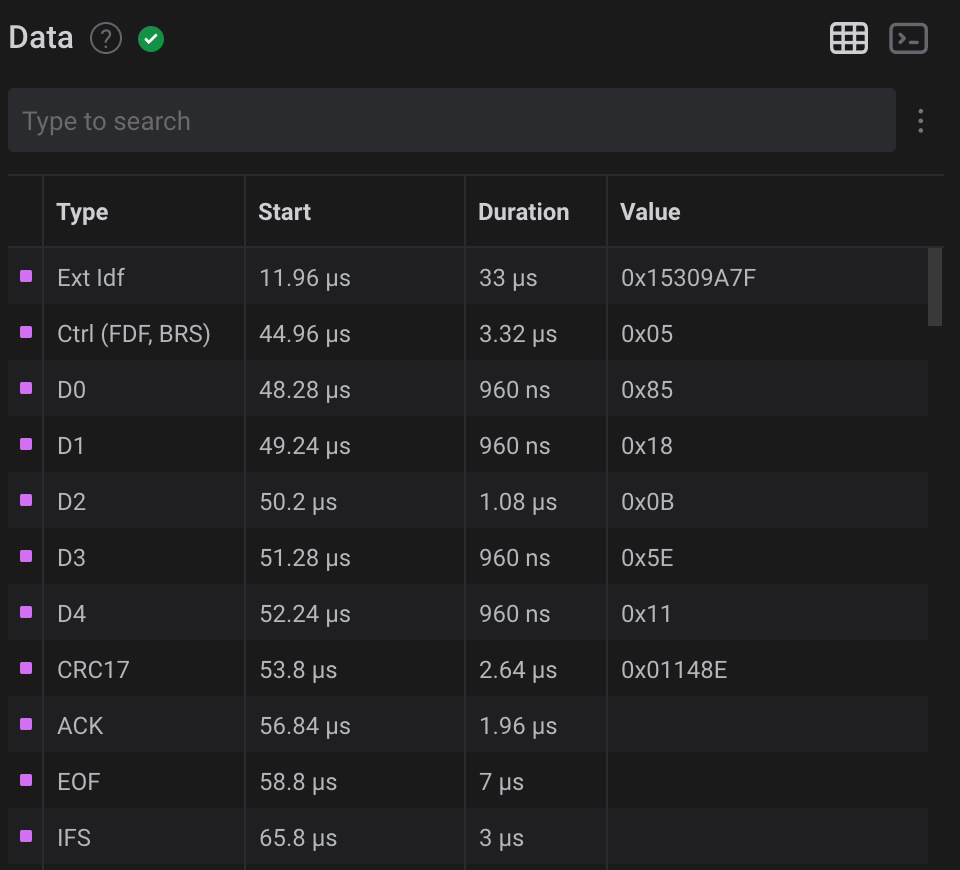

# canfd-plugin-for-saleae-logic-analyzer
CANFD Plugin for Saleae Logic2 Analyzer

For building the plugin, see [https://github.com/saleae/SampleAnalyzer](https://github.com/saleae/SampleAnalyzer)

## Generating Analyzer Simulation Data

(From [https://github.com/saleae/SampleAnalyzer](https://github.com/saleae/SampleAnalyzer))

*The Logic 2 software will need to be opened from the terminal using a specific command to enable simluation mode. Otherwise, by default, when an analyzer is added to digital channels while in Demo mode (i.e. no Logic is connected to the PC), the simulation data on those digital channels will contain seemingly random transitions and will not contain analyzer-specific data.*

*For instructions on enabling simulation mode on the Logic 2 software, please follow the instructions here:*
[https://support.saleae.com/user-guide/using-logic/demo-mode#generating-analyzer-simulation-data](https://support.saleae.com/user-guide/using-logic/demo-mode#generating-analyzer-simulation-data)

### How to permanently enable simulation on Mac OS X

Here is a trick for permanently enabling simulation on Mac OS X. Just copy the `name.pcmolinaro.saleaeEnableSimulation.plist` file (located in `enable-simulation-on-osx` directory) in your `~/Library/LaunchAgents` directory. Then log out then log in (or restart), it is done, simulation is permanently enabled.

For permanently  disabling this feature, delete `~/Library/LaunchAgents/name.pcmolinaro.saleaeEnableSimulation.plist` and log out then log in (or restart).

## Selecting Analyzer

The analyzer Name is `CANFD (Molinaro)`.

## Plugin settings

### CAN Arbitration Bit Rate

Usual CAN bit rates settings are `1000000` (1 Mbit/s), `500000` (500 kbit/s), `250000` (250 kbit/s), `125000` (125 kbit/s), `62500` (62.5 kbit/s). But you can use any custom setting (maximum is 1 Mbit/s).

### CAN Data Bit Rate

CANFD frames with their `BRS`bit recessive uses the data bit rate for transmitting data and CRC. Maximum is 8 Mbit/s. 

### Dominant Logic Level

Usually, CAN Dominant level is `LOW` logic level. This setting enables selecting `HIGH` as dominant level. 

### CANFD Protocol

There are two incompatible implementations of the CANFD protocol: 

* `ISO`: the protocol normilized by ISO;
* `Non ISO`: the original protocol from Bosh.

There are two differences between theses two protocols:

* initial values of CRC17 and CRC21: 0 in non ISO, in ISO initial value of CRC17 is `1 << 16`, and initial value of CRC21 is `1 << 20`;
* ISO frames have a new SBC field before the CRC field.

### Simulator Random Seed

*This setting is only used be the simulator. The simulator is enabled when no device is connected the analyzer.*

The simulator generates random frames. This setting defines the initial value of this parameter, making frame generation reproducible. 

### Simulator Generated Frames Format

*This setting is only used be the simulator. The simulator is enabled when no device is connected the analyzer.*

You can set the format (standard / extended) and the the type (data / remote) that the simulator generates:

* `All Types`: the simulator randomly generates CAN 2.0B standard / extended, data / remote frames, and CANFD frames;
* `Only CAN 2.0B Standard Data Frames`: the simulator randomly generates CAN 2.0B standard data frames;
* `Only CAN 2.0B Extended Data Frames`: the simulator randomly generates CAN 2.0B extended data frames;
* `Only CAN 2.0B Standard Remote Frames`: the simulator randomly generates CAN 2.0B standard remote frames;
* `Only CAN 2.0B Extended Remote Frames`: the simulator randomly generates CAN 2.0B extended remote frames;
* `Only CANFD Standard Data Frames, 0-16 bytes`: the simulator randomly generates CANFD standard data frames up to 16 data bytes (theses frames use CRC17);
* `Only CANFD Extended Data Frames, 0-16 bytes`: the simulator randomly generates CANFD extended data frames up to 16 data bytes (theses frames use CRC17);
* `Only CANFD Standard Data Frames, 20-64 bytes`: the simulator randomly generates CANFD standard data frames with 20 data bytes or more (theses frames use CRC21);
* `Only CANFD Extended Data Frames, 20-64 bytes`: the simulator randomly generates CANFD extended data frames with 20 data bytes or more (theses frames use CRC21).

### Simulator ACK SLOT generated level

*This setting is only used be the simulator. The simulator is enabled when no device is connected the analyzer.*

The `ACK SLOT` field of a frame is sent recessive, and set dominant by any receiver that gets the frame without any error.

Three settings are available:

* `Dominant`: the simulator generates frames with the ACK SLOT bit dominant;
* `Recessive`: the simulator generates frames with the ACK SLOT bit recessive;
* `Random`: the simulator generates frames with the ACK SLOT bit randomly dominant or recessive.

### Simulator BSR Generated Level

*This setting is only used be the simulator. The simulator is enabled when no device is connected the analyzer.*

The `BSR` bit specifies if the data bit rate is used for sending a CANFD frame:
* `dominant`, the frame is sent at arbitration bit rate;
* `recessive`, the fields from `DATA` up to `CRC` of a CANFD frame is sent at data bit rate.

Three settings are available:

* `Recessive`: the `BSR` bit is recessive;
* `Dominant`: the `BSR` bit is dominant;
* `Random`: the `BSR` is randomly recessive or dominant.

### Simulator ESI Generated Level

*This setting is only used be the simulator. The simulator is enabled when no device is connected the analyzer.*

The `ESI` bit of a CANFD frame indicates the sender state:

* `dominant`, the sender is error active;
* `recessive`, the sender is error passive.

Three settings are available:

* `Recessive`: the `ESI` bit is recessive;
* `Dominant`: the `ESI` bit is dominant;
* `Random`: the `ESI` is randomly recessive or dominant.

### Capture Display

This is the capture of a CANFD Standard data frame in ISO format, identifier `0x785`, with `BRS` bit recessive, and two data byte (`0x0B` and `0x5E`), with `ACK SLOT` dominant.

By default, a dot indicates the center of a bit sent at arbitration bit rate, a square indicates the center of a bit sent at data bit rate.

The orange square is an `IDLE` bit (from release 1.1.0).

The green dot is the `SOF` (*Start Of Frame*) field.

A white `X` is a Stuff Bit.

A fixed form bit is denoted by a `0` (for a dominant bit) or a `1` (recessive bit). *Note the level inversion does not change the annotation.* 

The `RTR`, `SRR`, `BSR` and the `ESI` bits are denoted by an `up arrow` (if recessive), or a `down arrow` (if dominant).

A recessive `ACK SLOT` bit is marked with a red `X`, an active one with a down arrow.

Errors are in red color: a red `X` is a Stuff Error, and following bits are tagged with red dots until the bus returns free (11 consecutive recessive bits at arbitration bit rate).

## Bubble Text

The bubble text is the text over the capture.

All CAN frames fields are reported, but:

* the `SOF` field that is denoted by a green dot.
* the `CRC DEL` field, a fixed form recessive bit after the `CRC` field.

If a CRC error is detected, the text is `CRC: xxx (error)`.
 
## Terminal

For each frame, the terminal contains:

* the identifier;
* the data bytes;
* if there is a CRC error, the CRC field;
* the frame bit length, its duration, and the number of stuff bits.

 
## Data Table

Every frame field is reported in data table. A CAN 2.0B control field type is  `Ctrl`, a CANFD one is `Ctrl (FDF)`, with two additional flags: `BRS`, `ESI`.

